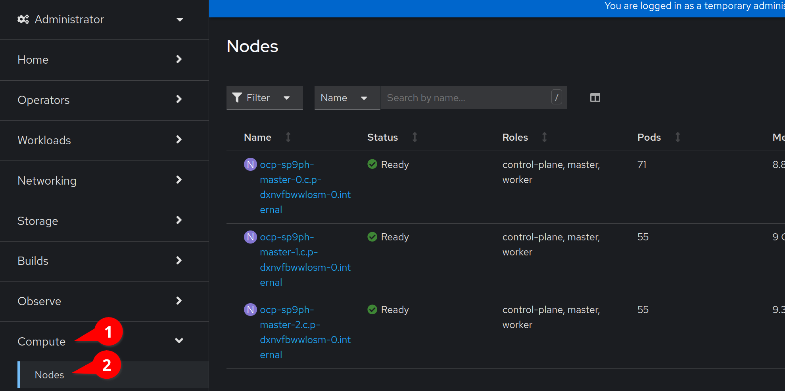
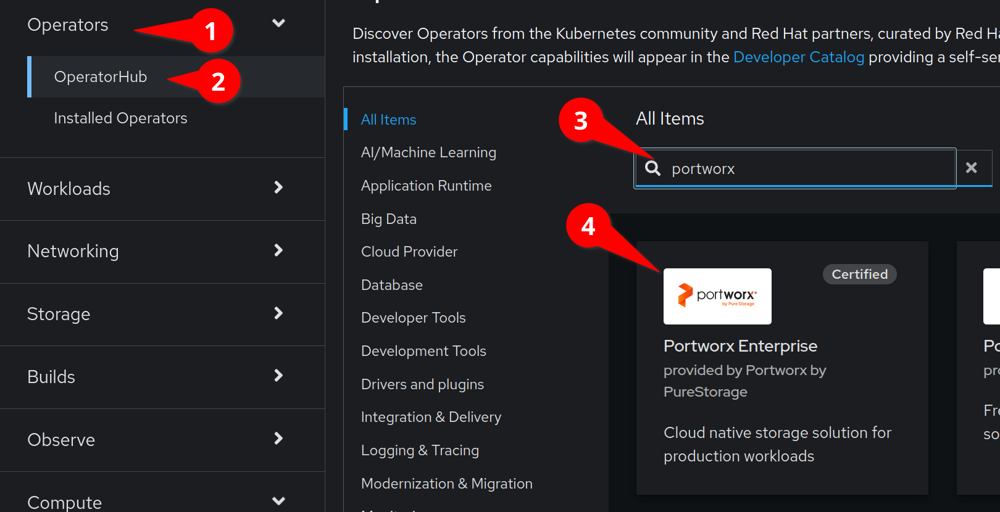
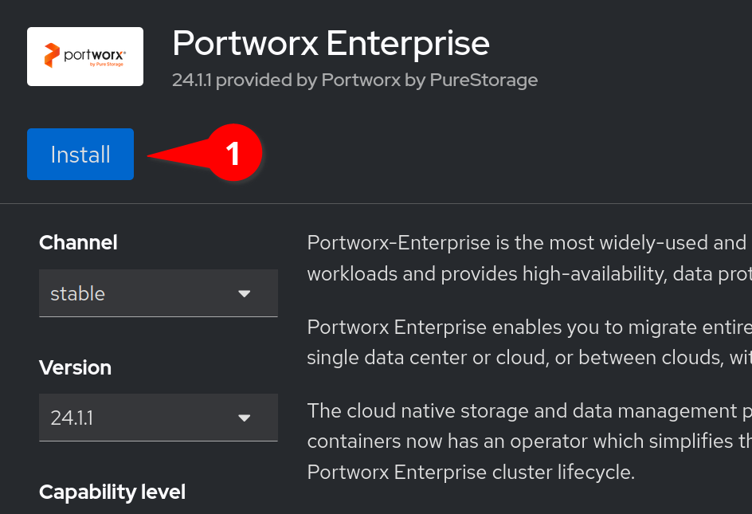
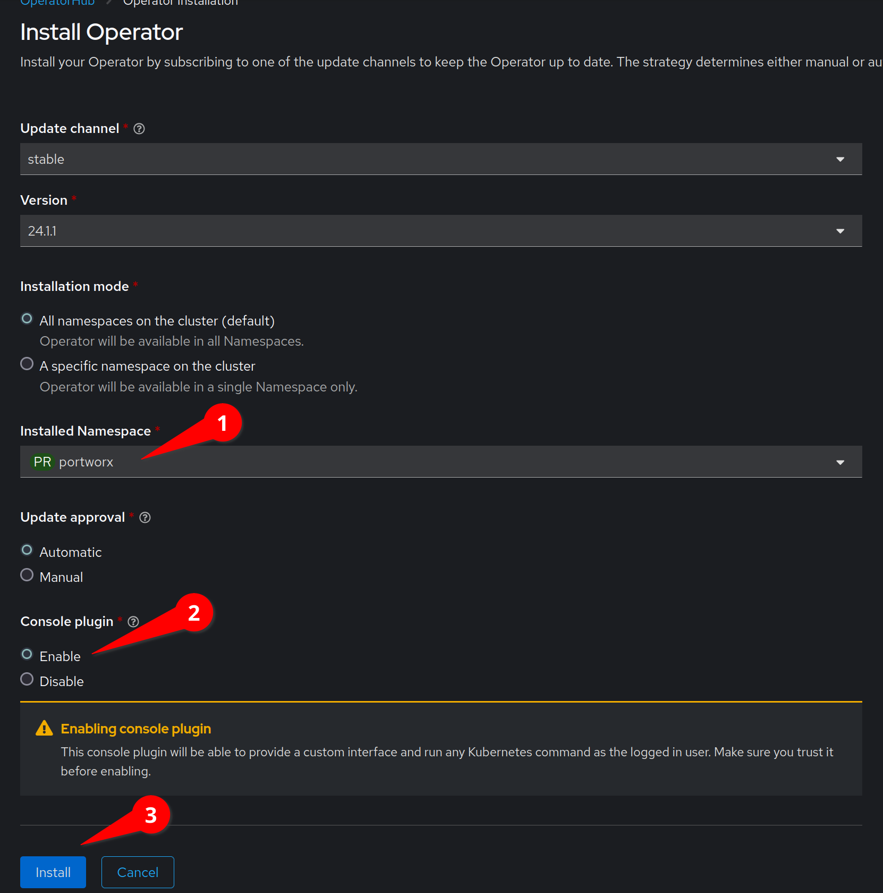

Getting familiar with Red Hat Openshift
=====

Our first task is to get familiar with how to access openshift. We will use both the `oc` CLI utility as well as the Red Hat OpenShift console.

Let's start with the CLI

### Task: Exploring the CLI

Red Hat OpenShift uses the `oc` cli utility. This utility has a similar syntax to kubectl, but with some OpenShift specific extensions.

Let's look at the nodes that make up our cluster:

```bash,run
oc get nodes
```

Note that the `oc` utility has been configured with everything we need to connect.

### Task: Exploring the OpenShift Console

To connect to the console, click on the tab above.

> [!IMPORTANT]
> The `OpenShift Console` tab will open in a new browser window. Because we are using a self signed certificate, you will need to bypass your web browsers security features to connect.

We can then log in with the following credentials:

Username: `kubeadmin`
Password: `[[ Instruqt-Var key="KUBEADMIN_PASSWORD" hostname="cloud-client" ]]`

Now that we have logged in to the console, we can explore some of the interface elements.

Navigate to `Compute` > `Nodes` as seen in the screenshot below.



Install Portworx
=====

To install Portworx, we first need to install the Portworx Operator.

### Task: Install the Portworx Operator

Navigate to `Operators` > `Operator Hub` and type `Portworx` in to the filter as seen in this screenshot:



and then click on the `Portworx Enterprise` operator.

We will now see the installation screen on the right of our interface. The defaults will suffice, and will grab the latest stable version of the operator. Click `Install`



On the next screen, `enable` the `Console plugin`

Create the a new project named `portworx` and install the Portworx operator in to the new `portworx` project.



and click the `Install` button.

The installation will prompt you to create a `StorageCluster` object, instead, click `View installed Operators in Namespace portworx`

### Task: Install Portworx StorageCluster

For this step, we need to switch back to our `Terminal` tab in the Instruqt interface.

Installing the the Portworx StorageCluster requires a few steps. We need to ensure that we have a service account secret for our gcloud environment to create and manage disks. Portworx will create and expand GCP disks based on our specifications.

Create this secret by running:
```bash,run
echo $INSTRUQT_GCP_PROJECT_GCPPROJECT_SERVICE_ACCOUNT_KEY | base64 -d > gcloud.json
oc -n portworx create secret generic px-gcloud --from-file=gcloud.json
```

We can now grab our StorageCluster specification:
```bash,run
curl -o px-spec.yaml "https://install.portworx.com/3.1?operator=true&mc=false&kbver=1.29.8&ns=portworx&b=true&iop=6&s=%22type%3Dpd-standard%2Csize%3D50%22&ce=gce&r=17001&c=px-cluster&osft=true&stork=true&csi=true&mon=true&tel=false&st=k8s&promop=true"
```

We now need to insert a reference for our secret in to our StorageCluster specification. This can be done with a little `yq` magic:
```bash,run
yq -iy '.spec.volumes += [{"name": "gcloud", "mountPath": "/etc/pwx/gce", "secret": {"secretName": "px-gcloud"}}] | .spec.env += [{"name": "GOOGLE_APPLICATION_CREDENTIALS", "value": "/etc/pwx/gce/gcloud.json"}]' px-spec.yaml
```

Take a look at our current manifest by using the ccat utility:
```bash,run
ccat px-spec.yaml
```

- Lines 14-16 contain our disk configuration. These disks will be created and attached as part of the Portworx installation.
- Lines 35-37 contain a reference to our OpenShift secret that we will use to provision the above disk specification.


Additional documentation can be found [here](https://docs.portworx.com/portworx-enterprise/platform/openshift/ocp-gcp/install-on-ocp-gcp)


We can now apply the specification:
```bash,run
oc apply -f px-spec.yaml
```

The install can take about 5 minutes. We can watch the containers come up by running:
```bash,run
watch oc -n portworx get pods
```

When all three of the `px-cluster` pods have a Ready status of `1/1` we can press `ctrl-c` to exit out of our watch command.

### Task: Check the Portworx cluster status

Portworx ships with a `pxctl` CLI utility that you can use for managing Portworx. We'll cover this utility more in the labs here in a little bit!

For now, we'll run `sudo pxctl status` via `oc` in one of the Portworx pods to check the StorageCluster status.

First, setup the `PX_POD` environment variable:
```bash,run
PX_POD=$(oc get pods -l name=portworx -n portworx -o jsonpath='{.items[0].metadata.name}')
```


Next, use `oc` to execute `sudo pxctl status` within a pod defined by the `PX_POD` environment variable to check the Portworx StorageCluster status:
```bash,run
oc exec -it $PX_POD -n portworx -- /opt/pwx/bin/pxctl status --color
```

We now have a 3-node Portworx cluster up and running!

Let's dive into our cluster status:
 - All 3 nodes are online and use Kubernetes node names as the Portworx node IDs.

 - Portworx detected the block device media type as "STORAGE_MEDIUM_MAGNETIC", and created a storage pool for those disks. If you have different types of disk, for example SSD and magnetic/rotational disk, a dedicated storage pool would be created for each type of device.

To make things easier throughout the lab, let's set a bash alias for pxctl:
```bash,run
echo "alias pxctl='PX_POD=\$(oc get pods -l name=portworx -n portworx --field-selector=status.phase==Running | grep \"1/1\" | awk \"NR==1{print \$1}\") && oc exec \$PX_POD -n portworx -- /opt/pwx/bin/pxctl'" >> /root/.profile
source /root/.profile
```

Now test out the alias:
```bash,run
pxctl status --color
```

Lastly, some functions of OpenShift require a default StorageClass, let's set one now:

And let's set it as the default StorageClass:
```bash,run
kubectl patch storageclass px-csi-db -p '{"metadata": {"annotations":{"storageclass.kubernetes.io/is-default-class":"true"}}}'
```

We can now move on to our next challenge by clicking the `Check` button.