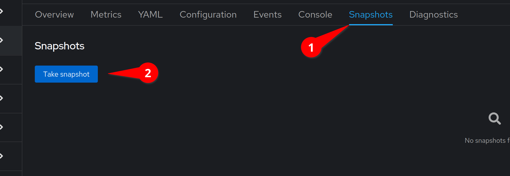
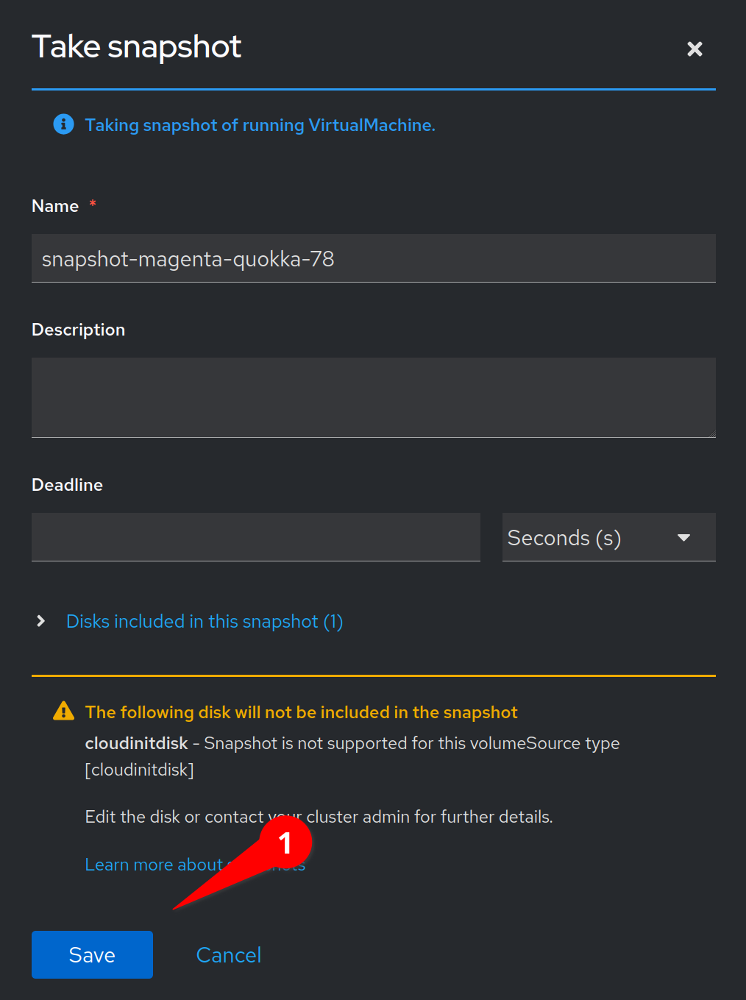
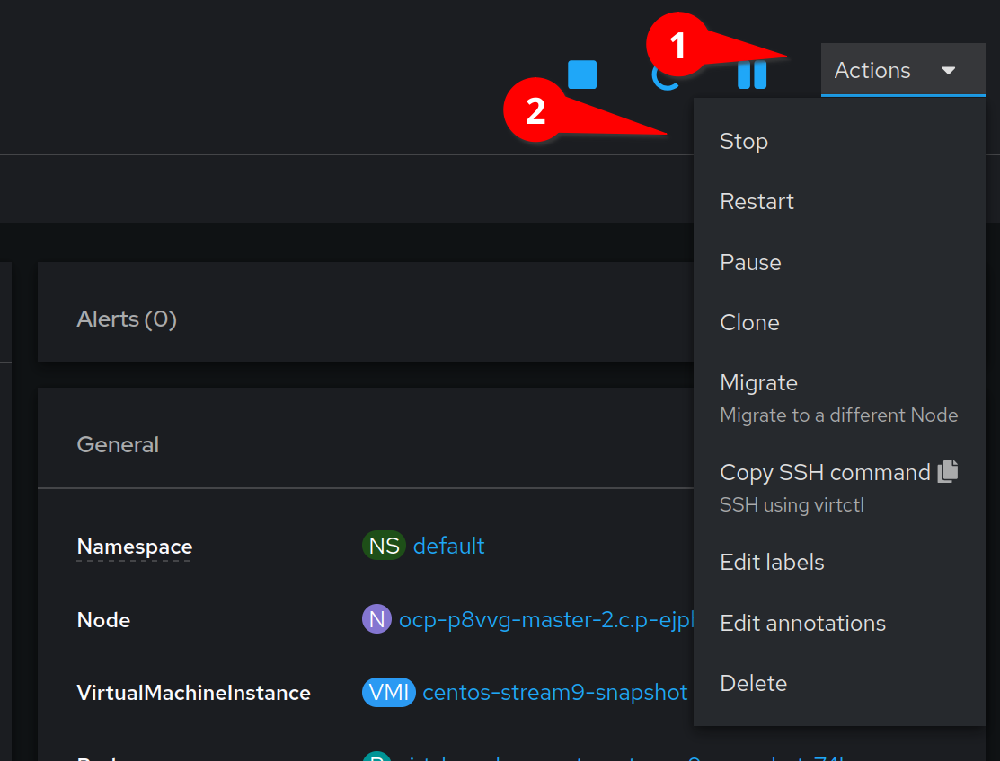
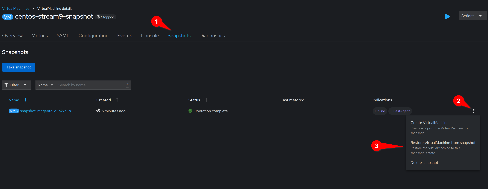

Scenario - Virtual Machine snapshots with Portworx
=====
In this scerario, create a virtual machine snapshot.

We have created a new virtual machine that we will be using for this excercise.

### Reminder: Accessing the Openshift Console

To connect to the console, click on the tab above.

> [!IMPORTANT]
> The `Openshift Console` tab will open in a new browser window. Because we are using a self signed certificate, you will need to bypass your web browsers security features to connect.

We can then log in with the following credentials:

Username: `kubeadmin`
Password: `[[ Instruqt-Var key="KUBEADMIN_PASSWORD" hostname="cloud-client" ]]`


Virtual Machine Snapshots
=====

### Task 1: Create a VolumeSnapshotClass

In order to take snapshots, we need to configure a VolumeSnapshotClass.

Run the following from our terminal tab:

```bash,run
cat << EOF | oc apply -f -
apiVersion: snapshot.storage.k8s.io/v1
kind: VolumeSnapshotClass
metadata:
 name: px-csi-snapclass
 annotations:
   snapshot.storage.kubernetes.io/is-default-class: "true"
driver: pxd.portworx.com
deletionPolicy: Delete
parameters:
 csi.openstorage.org/snapshot-type: local
EOF
```


### Task 2: Take a snapshot of our new VM


Log in to the Openshift Console by following the instructions above.

Click on the `Virtualization` menu item, followed by `VirtualMachines`. We can then find the virtual machine we will be using for this snapshot.

Click on the VM labeled `centos-stream9-snapshot`.


Navigate to the `Snapshots` tab and select `Take Snapshot`



We can accept the default and select `Save`

> Note: You will see a warning that our `cloudinitdisk` will not be included in this snapshot. The `cloudinitdisk` is only used to configure our virtual machine and provide customizations. We can safely ignore this warning.



### Task 3: Make a change to our VM

Let's switch back to the command line. To make a change, we are simply going to make a change to our running virtual machine.

Let's accidently delete an important file:

```bash,run
virtctl ssh cloud-user@centos-stream9-snapshot -t "-o StrictHostKeyChecking=no" -c 'sudo rm /etc/fstab'
```

Oh no! fstab is an important file for the operation of our linux system. We can verify that the file is indeed missing by running:

```bash,run
virtctl ssh cloud-user@centos-stream9-snapshot -t "-o StrictHostKeyChecking=no" -c 'cat /etc/fstab'
```

Let's fix our VM

### Task 4: Restore our snapshot

Let's log back in to the Openshift Console.

Click on the `Virtualization` menu item, followed by `VirtualMachines`. We can then find the virtual machine we will be using for this snapshot.

Click on the VM labeled `centos-stream9-snapshot`.


Click on the `Actions` menu, and select `Stop`



This will stop our running VM so that we can restore our snapshot.


Click on the `Snapshots` tab. Then click on the kebab menu by the snapshot we created earlier and click `Restore VirtualMachine from snapshot`




> [!Important]
> Restoring a snapshot is a distructive operation as it discards all changes that were made to a virtual machine since the snapshot was taken. To avoid loosing data, it is possible to take a snapshot before restoring our virtual machine.

Confirm the restore by clicking the `Restore` button.

We can now start our virtual machine by clicking on the `Action` menu and clicking `Start`


We can check on the progress of our virtual machine's boot by clicking on the `Console` or `Overview` tab.

Task 5: Verify our restore

After a couple of minutes, our VM should be running. Let's verify that our fstab file is back in place:

```bash,run
virtctl ssh cloud-user@centos-stream9-snapshot -t "-o StrictHostKeyChecking=no" -c 'cat /etc/fstab'
```

We can now see the contents of the fstab file!